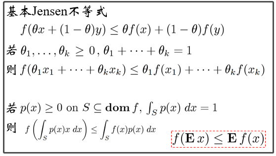

# 机器学习中需重点掌握的数学基础知识

- 微积分、梯度和Jensen不等式
- Taylor展开及其应用
- 常见概率分布和推导
- 指数族分布
- 共轭分布
- 统计量
- 矩估计和最大似然估计
- 区间估计
- Jacobi矩阵
- 矩阵乘法
- 矩阵分解RQ和SVD
- 对称矩阵
- 凸优化

## 微积分、梯度和Jensen不等式、Taylor展开及其应用

- 极限的定义:

- 导数的意义：

- 常用函数的导数：

- 方向导数与梯度：

- Jensen不等式：

- Taylor公式：

- 应用--[xgboost的目标函数](https://xgboost.readthedocs.io/en/latest/tutorials/model.html)

## 概率论

- 概率公式：

- 常见的概率分布：

- 概率统计与机器学习的关系：

- 统计量--期望：

- 统计量--方差：

- 统计量--协方差：

- 偏度和峰度
- 中心极限定理
- 矩估计和区间估计和极大似然估计
- 指数族分布
- 共轭分布

## 矩阵

- 矩阵乘法
- 矩阵分解

## 凸优化

- 凸函数的定义：

- 凸函数举例：

## 参考资料

本文主要参考资料为：
- [机器学习中的数学基础](https://pan.baidu.com/s/1ZRis4diXWLx6VJ-Apr7s2A) 提取码：1ar4 
- Prof. Andrew Ng, Machine Learning, Stanford University
- 高等数学，高等教育出版社，同济大学数学教研室 主编, 1996
- Mia Hubert, Peter J. Rousseeuw, Karlien Vanden Branden, ROBPCA: a New Approach to Robust Principal Component Analysis, October 27, 2003(PCA)
- [泛化能力](http://baike.baidu.com/view/3709181.htm)
- [核回归](http://people.revoledu.com/kardi/tutorial/Regression/KernelRegression/KernelRegression.htm)
- [VC维](http://www.cnblogs.com/wuyuegb2312/archive/2012/12/03/2799893.html)
- [SVM](http://blog.csdn.net/v_july_v/article/details/7624837)
- [Bayes](http://mindhacks.cn/2008/09/21/the-magical-bayesian-method)
- [机器学习](http://www.cnblogs.com/jerrylead/tag/Machine%20Learning)
- [SVD](http://baike.baidu.com/view/3068725.html)
- [广义逆矩阵](http://www.cnitblog.com/vincentff7/)
- [奇异值分解-wiki](http://zh.wikipedia.org/wiki/%E5%A5%87%E5%BC%82%E5%80%BC%E5%88%86%E8%A7%A3)
- [凸函数](http://baike.baidu.com/view/186428.htm)
- [世界数学公式大全](http://people.math.sfu.ca/~cbm/aands/)