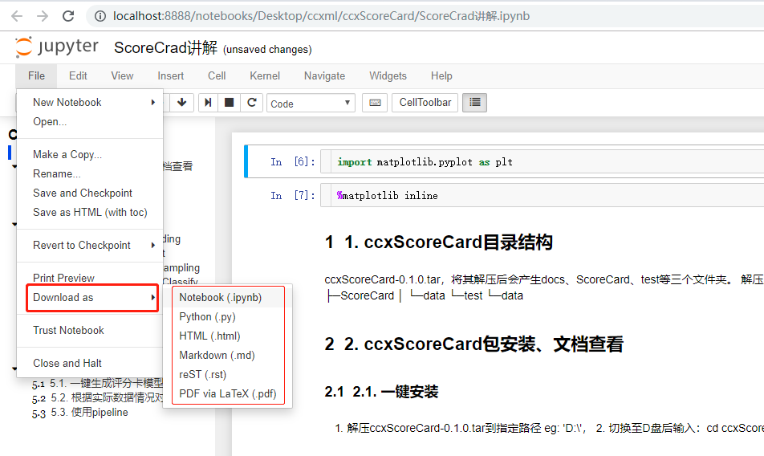

# python编辑器的高级功能

本文主要内容有：

- 如何使用pycharm来开发一个建模项目
- 利用pycharm进行远程连接与调试
- jupyter的一些妙用

## 如何使用pycharm来开发一个建模项目

- 1.创建项目
    - 方式1，使用虚拟环境，优点为不同的项目可以使用不同的Python版本，不同的Python包版本
    - 方式2，使用已安装的环境，优点为不需要重复安装好多常用模块
    

- 2.协作开发
    使用版本管理工具(svn)来完成版本同步

    

    引入后，同一项目组内，可实现版本控制和协作开发。
- 3.常用快捷键推荐
    - Ctrl+Alt+L 代码格式化 避免版本冲突的神器
    - Alt+Enter 自动化引入模块
    - Ctrl+鼠标左键 查看源代码
    - Ctrl+Alt+-> 向前一步
    - Ctrl+Alt+<- 向后一步
    - Ctrl+Alt+E 执行代码块（可修改）
    - Ctrl+D 复制当前行至下一行
    - Ctrl+X 剪切当前行

## 利用pycharm进行远程连接与调试

- 1.安装pycharm的profess版
安装文件在此共享文件夹路径下：本人共享文件夹里（可能失效）\\\\10.0.2.62\Ccx_Fp_ABS\pycharm-professional-2017.3.3.exe

- 2.破解专业版为一段时间内的免费版
目前可行的破解方式如下：参考链接：http://idea.lanyus.com/
    - 2.1 修改hosts文件
    本人win10系统的hosts路径为 C:\Windows\System32\drivers\etc\hosts
    
    - 2.2 使用激活码进行激活
    安装专业版pycharm，在首次打开安装好的pycharm专业版中，选择激活方式为active code 复制参考链接中的code。
    
    - 2.3 远程连接192.168.100.175服务器
    大致步骤：
        1.服务器创建一个目录，用于和本地文件同步
        2.配置配置文件，保持本地和服务器项目文件的一致性
        3.启用远程连接接口

        - 192.168.100.175 的目录结构：
        
        各自在各自的文件夹下去远程调试，然后通过svn去同步最新代码。

        - 配置远程同步/部署（depolyment）的相关配置
        大致原理为sftp协议，将本地的项目文件和服务器的项目文件进行mapping，达到本地修改实时同步到服务器的功能。
        注：100.175的账号密码为： root   ykLH8Jd7AJcPimT0

        
        
        

        - 配置通过ssh来实现远程调试
        基本原理为，将项目的接口更改为远程的python接口，这样就能实现，本地笔记本电脑电脑里的pycharm，使用的却是远程服务器的计算资源。

        
        
        

        至此，需要等待大概1小时左右，pycharm就会顺利的帮你配置好各种东西。便可以实现相关的操作了。

    - 2.4 远程连接后具有相关功能
        查看远程服务器的目录

        
        

        本地cmd环境和linux环境的自由切换

        

        执行API文件，其实使用的是服务器的python

        

        上传本地文件至服务器

        

其余功能大家平时使用中积极发现和探索吧。


## jupyter的一些妙用

 - 目录插件及常用的快捷键
 - 快速的编辑文档
 - 具有交互的图表工具 

#### 目录插件及常用的快捷键
参考链接：
[Jupyter Notebook之提高可读性——插件安装及使用（包括插入目录，目录索引及缩进）](https://blog.csdn.net/wmhshishen/article/details/80398370)


```python
# 联网情况下
conda install -c conda-forge jupyter_contrib_nbextensions
# 不联网情况下，安装相关的依赖包，重启后即可

```

[Jupyter 常用快捷键 及 常用方法笔记](https://blog.csdn.net/mr_cookies/article/details/78063722)

```
快捷键

 

Ctrl+enter    执行本cell

shift+enter     执行本cell且 向下建立一个新cell

A        向上建立一个cell

B        向下建立一个cell

esc+m m       把cell切换至markdown模式

esc+y y       把cell切换至code模式

esc+l l            显示行数

d d                删除cell

O         收起output 或者打开output

在这里我要自定义一个快捷键ctrl+O , 语法如下

Valid Examples: Shift-a, Ctrl-;, or Ctrl-Shift-a.
ctrl+o        收起或打开全部output

   

复合快捷键

shift        选中多个cell

然后执行 shift+M    合并选中cell
```

#### 快速的编辑文档
jupyter notebook 其实本身就是一个强大的文档编辑器，其支持的文档格式众多，学会妙用，能使得个人爱上写笔记，喜欢记录电子档的笔记。

示例：/Desktop/ccxml/ccxScoreCard/ScoreCrad讲解.ipynb

#### 具有交互的图表工具
jupyter notebook支持交互的图表插件，直接允许用户在页面上拖拽、放大、截取图表。具体使用方法见数据可视化部分。