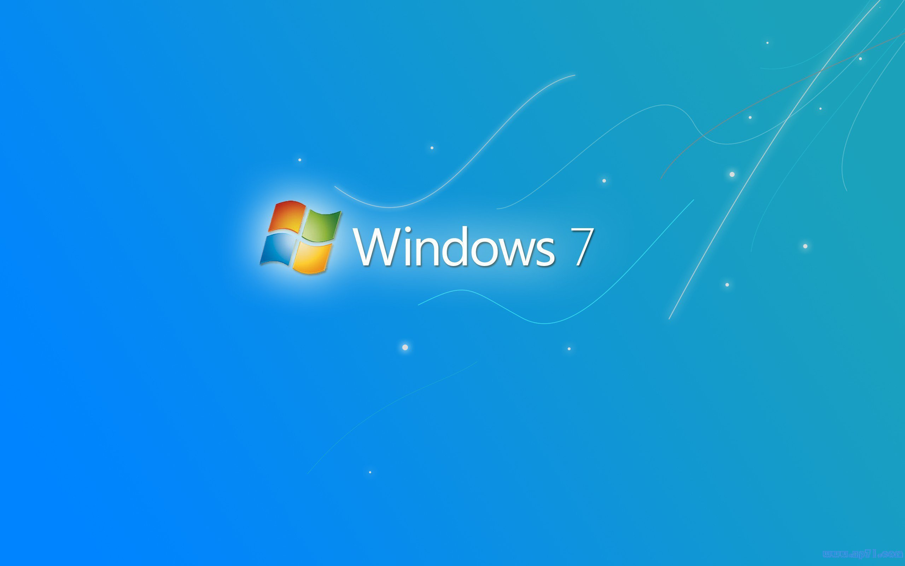
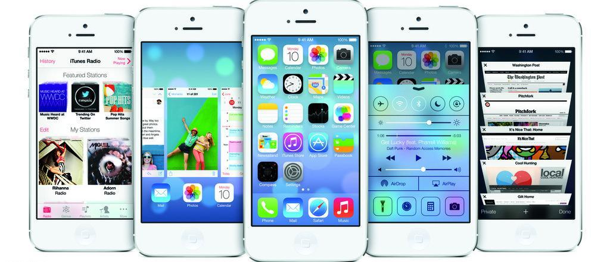
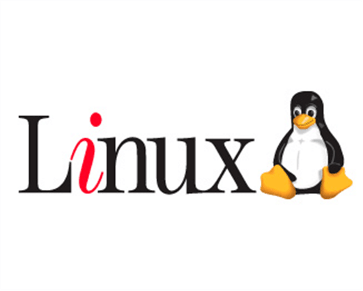
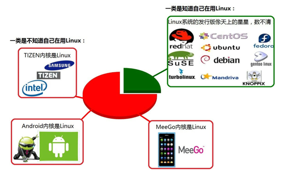
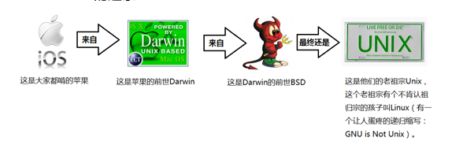

## 认识Linux
### 1.什么是操作系统

### 2.现实生活中的操作系统
#### windowns

#### Mac

#### Android

#### iOS

### 3.操作系统的发展史
#### Unix
1965年之前的时候，电脑并不像现在一样普遍，它可不是一般人能碰的起的，除非是军事或者学院的研究机构，而且当时大型主机至多能提供30台终端（30个键盘、显示器)，连接一台电脑.

为了解决数量不够用的问题

1965年左后由贝尔实验室、麻省理工学院 以及 通用电气共同发起了Multics项目，想让大型主机支持300台终端

1969年前后这个项目进度缓慢，资金短缺，贝尔实验室退出了研究

1969年从这个项目中退出的Ken Thompson当时在实验室无聊时，为了让一台空闲的电脑上能够运行“星际旅行”游行，在8月份左右趁着其妻子探亲的时间，用了1个月的时间 编写出了 Unix操作系统的原型

1970年，美国贝尔实验室的 Ken Thompson，以 BCPL语言 为基础，设计出很简单且很接近硬件的 B语言（取BCPL的首字母），并且他用B语言写了第一个UNIX操作系统。

因为B语言的跨平台性较差，为了能够在其他的电脑上也能够运行这个非常棒的Unix操作系统，Dennis Ritchie和Ken Thompson 从B语言的基础上准备研究一个更好的语言

肯·汤普逊（左）和丹尼斯·里奇（右）

1972年，美国贝尔实验室的 Dennis Ritchie在B语言的基础上最终设计出了一种新的语言，他取了BCPL的第二个字母作为这种语言的名字，这就是C语言

1973年初，C语言的主体完成。Thompson和Ritchie迫不及待地开始用它完全重写了现在大名鼎鼎的Unix操作系统

#### Minix

因为AT&T(通用电气)的政策改变，在Version 7 Unix推出之后，发布新的使用条款，将UNIX源代码私有化，在大学中不再能使用UNIX源代码。Andrew S. Tanenbaum(塔能鲍姆)教授为了能在课堂上教授学生操作系统运作的实务细节，决定在不使用任何AT&T的源代码前提下，自行开发与UNIX兼容的操作系统，以避免版权上的争议。他以小型UNIX（mini-UNIX）之意，将它称为MINIX。

#### Linux

因为Minix只是教学使用，因此功能并不强，因此Torvalds利用GNU的bash当做开发环境，gcc当做编译工具，编写了Linux内核-v0.02，但是一开始Linux并不能兼容Unix，即Unix上跑的应用程序不能在Linux上跑，即应用程序与内核之间的接口不一致，因为Unix是遵循POSIX规范的，因此Torvalds修改了Linux，并遵循POSIX（Portable Operating System Interface，他规范了应用程序与内核的接口规范）； 一开始Linux只适用于386，后来经过全世界的网友的帮助，最终能够兼容多种硬件；

### 操作系统的发展

### Minix没有火起来的原因
Minix的创始人说，MINIX 3没有统治世界是源于他在1992年犯下的一个错误，当时他认为BSD必然会一统天下，因为它是一个更稳定和更成熟的系统，其它操作系统难以与之竞争。因此他的MINIX的重心集中在教育上。四名BSD开发者已经成立了一家公司销售BSD系统，他们甚至还有一个有趣的电话号码1-800-ITS-UNIX。然而他们正因为这个电话号码而惹火上身。美国电话电报公司因电话号码而提起诉讼。官司打了三年才解决。在此期间，BSD陷于停滞，而Linux则借此一飞冲天。他的错误在于没有意识官司竟然持续了如此长的时间，以及BSD会因此受到削弱。如果美国电话电报公司没有起诉，Linux永远不会流行起来，BSD将统治世界。