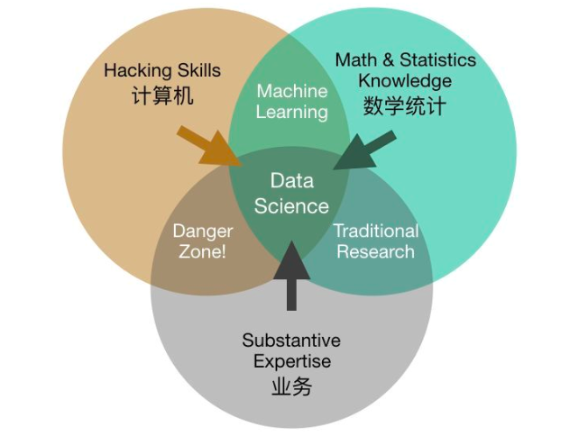
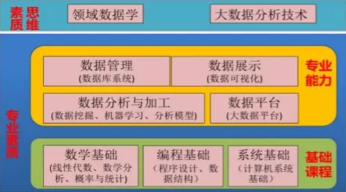
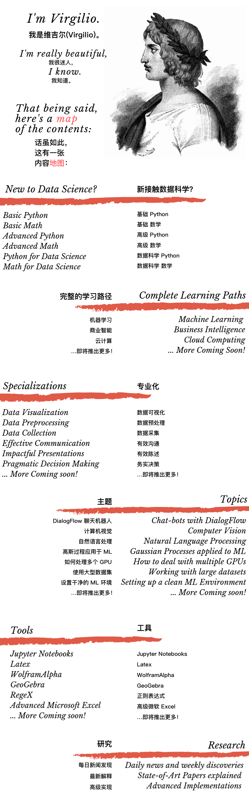
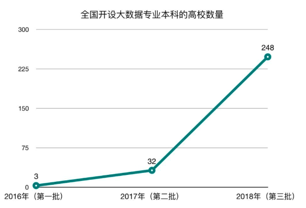
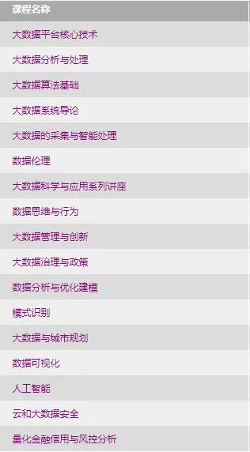
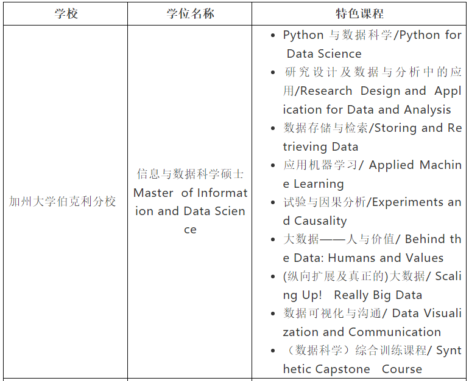

# 数据科学家的一小步--工具应用篇

## 数据科学的历史

数据科学历史上由来已久，但今年来随着互联网的发展，结合大数据背景，成为了一门当下热门学科，随着大数据浪潮的发展，成为了今年来，首屈一指的热门学科。尤其是机器学习，深度学习，计算机视觉等下属学科门类的发展，数据科学越来越多的进入了大家的视野。
作为一名从事相关工作的数据科学从业人员，经过自己多年的摸爬滚打与总结思考，借着部门分享的机会，写下此篇文章，供同行交流与学习。

数据科学的定义：

- wiki:强调了big data,most powerful 

    Data science is a multi-disciplinary field that uses scientific methods, processes, algorithms and systems to extract knowledge and insights from structured and unstructured data.[1][2] Data science is the same concept as data mining and big data: "use the most powerful hardware, the most powerful programming systems, and the most efficient algorithms to solve problems"
- 数据科学与大数据技术专业培养计划：强调了复合型人才

    数据科学与大数据技术专业主要培养面向大数据时代以计算机科学、统计分析为基础，以数据科学与大数据技术为研究领域，具备经济、金融、数据结构、数据计算智能、信息处理、程序设计、数据分析等相关学科的领域知识，能推动并引领未来全球“互联网+”、云计算、人工智能、大数据技术在各领域的深入应用，具有较强的实践创新能力、跨文化交流能力和跨领域研究、设计、开发能力高素质复合人才。
- 网页主流素材：强调了复合型，且如何复合

    

## 如何成为数据科学家

从上文中对数据科学的定义，要成为一名数据科学家，其至少应掌握三大学科门类的基础知识。

- 数学与统计学
- 计算机科学
- 业务科学

但上述三者均是巨大的学科门类，均需掌握，难度很大，所以个人认为，数据科学家，其不是一个人，而是一个“家”，其家中的人员各有所长，但三方面均有涉猎，高效交流，有效协作，共同成为数据科学"家"。

要成为数据科学"家"的一员，其下是个人收集的一些资料，或者说是学习路径，供大家参考：

- 从培养方向上看
    大数据与数据科学主要培养大数据应用分析师、大数据系统工程师、大数据算法研究员几大类，每个大类下又可以根据具体的岗位职责做一定的细分，大致可以分为如下这些：
    1、  大数据应用分析师：产品、行业应用、解决方案、数据分析、创新
    2、  大数据系统工程师：系统、架构、开发、维护、管理
    3、  大数据算法研究员：算法实现/调优、新理论、新结构/新算法、方向/趋势
- 从课程体系上看
    数学/统计理论：微积分、线性代数、概率论、数理统计、统计学习
    计算科学：计算机系统、编程语言、数据结构、信息系统架构（CS/BS等）
    数据系统：分布式理论、Hadoop/Spark生态、数据库/数据仓库
    模型分析：机器学习理论、优化建模、模式识别、知识表示/推理、可视化分析
    行业应用：商务智能、智能金融、供应链分析、城市规划等
    数据伦理：大数据管理与创新、大数据治理与政策

    
- 参考业内先驱

    

此部分参考资料:

- [大数据与数据科学课程体系](https://mp.weixin.qq.com/s/ecoBfqFMOzmdIhrs6ckbCw)
- [获赞近10k的数据科学学习路径](https://github.com/clone95/Virgilio)

## 我国高校对数据科学相关专业的培养方案

从2016年开始，我国本科及研究生教育阶段开设了大数据与数据科学的相关专业，大致开设情况如下

首批首家开设数据科学研究院的清华大学，其课程体系如下：

其余国外著名学府相应的课程体系：

## 工具篇

基础知识

- 数学统计学基础：
    - [Mathjax与LaTex公式简介](https://www.cnblogs.com/linxd/p/4955530.html)
    - office公式编辑器：[Office公式编辑器怎么用？](https://jingyan.baidu.com/article/ca2d939d427f0aeb6c31ce88.html) [mathType官网介绍](http://www.mathtype.cn/)
    - 相关理论知识资料推荐与整理详见 [4.2.1数学统计学基础](./4.2.1数学统计学基础.md)

- 编程基础：
    - [Python、Anaconda、基础 详见2.1.1python入门教程推荐](../2.基础篇/2.1python入门/2.1.1python入门教程推荐.md)
    - 推荐的代码编辑器pycharm、jupyter的一些高级功能 详见 [4.2.2python编辑器的高级功能](./4.2.2python编辑器的高级功能.md)
- 系统基础：
    - windows、远程桌面；
    - linux、xshell、crt 详细见 [4.2.3Linux系统相关基础知识](../4.工具篇/4.2.3Linux系统相关基础知识/README.md)

专业能力

- 数据平台：mysql、hive、Hadoop、spark、数据的加密(md5/sha256)
- 数据展示：matplotlib、seaborn、plotly、pyecharts
- 数据分析与数据挖掘：<部门数据挖掘技术体系文案的整理与制作>
- 版本控制：SVN，git，github，gitlab

思维能力

- 著书立言：有道、印象、vscode、博客、公众号
- 业务思考：行业关注、线下沙龙、新闻关注
- 学习能力：勤学、善思、好问、笃行
